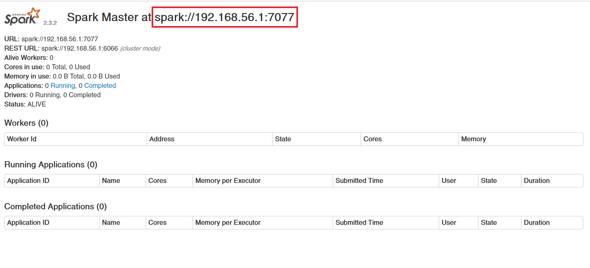
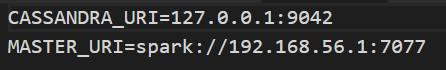

# Readme

## Setting up Python 2.7
1. Download and install Python 2.7 32-bit (we found Python 2.7.0 32-bit to work best, it can be found [here](https://www.python.org/download/releases/2.7/)).
2. Add your installation directory to the PATH environment variable of your system.
3. You might need to also add the PYTHONHOME environment variable and set it to your installation directory (ie. `PYTHONHOME=C:\Python27`).
4. You might need to also add the PYTHONPATH environment variable and set it to the Lib folder withing your installation directory (ie. `PYTHONPATH=C:\Python27\Lib`).
5. Lastly, [Freq.py](Freq.py) might require the `numpy` package. To install it, run the following command: `pip install numpy` 

## Setting up Cassandra
1. Download and install the DataStax Distribution of Apache Cassandra v3.9.0 from [here](https://academy.datastax.com/planet-cassandra//cassandra)
2. Run `{installation_dir}/bin/cassandra.bat`
3. Run `{installation_dir}/bin/cqlsh.bat`  and execute the following queries:
```cql
CREATE KEYSPACE receipts
WITH replication = {
	'class' : 'SimpleStrategy',
	'replication_factor' : 1
};

CREATE TABLE receipts.receipts (
	id uuid,
	products MAP<text, varint>,
	PRIMARY KEY (id)
);
```

## Setting up Spark
1. Download and install Apache Spark 2.3.2  from [here](https://www.apache.org/dyn/closer.lua/spark/spark-2.3.2/spark-2.3.2-bin-hadoop2.7.tgz)
2. Run `{installation_dir}/bin/spark-class.cmd org.apache.spark.deploy.master.Master`
3. Navigate to `localhost:8080`
4. Locate the master's URI at the top of the page. <br/>ie:
5. In 2 other separate command prompts, run `{installation_dir}/bin/spark-class.cmd org.apache.spark.deploy.worker.Worker {master_uri}`

## Setting up the REST server
1. Navigate to the "REST_API" folder.
2. Rename the `.env.example` file to `.env` and set the environment variables for the Cassandra DB and the Spark master (the Cassandra URL is most likely 127.0.0.1:9042). <br/>ie: 
3. In a command prompt, execute the following commands:
```
npm i
npm run serve
```


## REST API routes

### Add a receipt
`POST http://localhost:3000/`

Headers: `{Content-Type: application/json}`

Body:
```
 { 
   "id": "{receipt_id}", 
   "products": { 
     "Tomato": 10, 
     "Banana": 123,
     ...
    }  
 }
```   

### Get the frequent products
`GET http://localhost:3000/frequent`

### Get all the receipts
`GET http://localhost:3000/`

### Clear the database
`POST http://localhost:3000/clear`


## Testing with the REST client
To test the REST API (and therefore the entire project), you can use the provided Python 2.7 client: [rest_client.py](rest_client.py) 

To see the available commands for the client, you can run the following command:

`python rest_client.py -h`

**Note:** All components (REST API, Cassandra, Spark master, Spark workers) must be running for the client to work.

### Populating the database
To populate the database, you can use the following command:

`python rest_client.py populate`

**Warning:** Populating the database clears its current contents.

Additionally, you can specify the number of receipts to generate to populate the database in the following manner:

`python rest_client.py populate --nb_receipts 500`

If no number of receipts is specified, 100 receipts are generated.

Also, you can specify a category of products that you want to be more frequent like so:

`python rest_client.py populate --type pasta`

The available categories are the following: <br/>`{ cereals, vegetables, beer, fruits, pasta, spices }`

If no category is specified, a random one is selected.


### Getting the frequent products
To get the frequent products, you can run the following command:

`python rest_client.py frequent`

The output should look like this:

```
{ "product": "persil", "freq": 39 }
{ "product": "paprika", "freq": 36 }
{ "product": "poivre", "freq": 36 }
{ "product": "basilic", "freq": 32 }
{ "product": "sel", "freq": 32 }
{ "product": "thym", "freq": 31 }
{ "product": "origan", "freq": 31 }
{ "product": "cumin", "freq": 30 }
{ "product": "moutarde", "freq": 28 }
{ "product": "aneth", "freq": 27 }
```

Where `product` is the name of a frequent product and `freq` is the number of occurences (number of receipts containing that item).


### Getting all the receipts
To get the contents of the database (all the receipts), you can run the following command:

`python rest_client.py receipts`


### Clearing the databse
If you want to clear the current contents of the database, you can run the following command:

`python rest_client.py clear`
